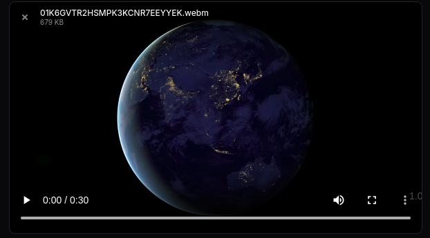

# Video Optimizer for Filament

[](https://packagist.org/packages/tonymans33/video-optimizer)
[](https://packagist.org/packages/tonymans33/video-optimizer)

Automatically optimize and convert videos uploaded through Filament forms using FFmpeg. Reduce file sizes and standardize formats without any manual intervention.

## Results

See the dramatic file size reduction:

### Before Optimization
**Original MP4**: 17.8 MB


### After Optimization
**Optimized WebM**: 679 KB (96% reduction!)



> 🎯 **Result**: Same video quality, **96% smaller file size** - from 17.8 MB down to just 679 KB!

## Features

- 🎬 **Automatic video optimization** during upload
- 🔄 **Format conversion** (WebM, MP4)
- ⚡ **Configurable quality levels** (low, medium, high)
- 📦 **Works with standard FileUpload and Spatie Media Library**
- 🔌 **Filament v3 & v4 compatible**
- 🛡️ **Graceful fallback** if optimization fails

## Requirements

- PHP 8.1+
- Laravel 10.0+
- Filament 3.0+ or 4.0+
- **FFmpeg installed on your server**

### Installing FFmpeg

```bash
# Ubuntu/Debian
sudo apt-get install ffmpeg

# macOS
brew install ffmpeg

# Verify installation
ffmpeg -version
```

## Installation

Install the package via Composer:

```bash
composer require tonymans33/video-optimizer
```

Publish the configuration file (optional):

```bash
php artisan vendor:publish --tag="video-optimizer-config"
```

## Usage

### Basic Usage

Replace Filament's `FileUpload` with `VideoOptimizer`:

```php
use Tonymans33\VideoOptimizer\Components\VideoOptimizer;

VideoOptimizer::make('video')
    ->disk('public')
    ->directory('videos')
    ->optimize('medium')  // 'low', 'medium', 'high', or null
    ->format('webm');     // 'webm', 'mp4', or null
```

### With Spatie Media Library

For projects using [Spatie Media Library](https://github.com/spatie/laravel-medialibrary):

```php
use Tonymans33\VideoOptimizer\Components\SpatieMediaLibraryFileUpload;

SpatieMediaLibraryFileUpload::make('videos')
    ->collection('videos')
    ->multiple()
    ->optimize('medium')
    ->format('webm');
```

### Using the Facade

```php
use Tonymans33\VideoOptimizer\Facades\VideoOptimizer;

VideoOptimizer::make('video')
    ->optimize('high')
    ->format('mp4');
```

## Configuration

Set global defaults in `config/video-optimizer.php`:

```php
return [
    // Default optimization level: null, 'low', 'medium', 'high'
    'optimize' => null,

    // Default output format: null, 'webm', 'mp4'
    'format' => null,
];
```

Component-level settings override these defaults.

## Optimization Levels

| Level | CRF | File Size | Quality | Use Case |
|-------|-----|-----------|---------|----------|
| `low` | 36 | Smallest | Lower | Web previews, thumbnails |
| `medium` | 28 | Balanced | Good | **Recommended for most use cases** |
| `high` | 20 | Larger | Best | High-quality content, archives |
| `null` | - | Original | Original | No optimization |

**CRF** = Constant Rate Factor (lower = better quality, larger file)

## Supported Formats

- **webm** - Modern, efficient format with excellent compression
- **mp4** - Universal compatibility using H.264 codec
- **null** - Keep original format

## How It Works

1. User uploads a video through your Filament form
2. Component detects video MIME type
3. If optimization/conversion is enabled:
   - Creates temporary file
   - Processes with FFmpeg
   - Saves optimized version
   - Cleans up temporary files
4. If processing fails, original file is uploaded (graceful fallback)

## Advanced Example

```php
use Tonymans33\VideoOptimizer\Components\VideoOptimizer;

VideoOptimizer::make('promotional_video')
    ->label('Promotional Video')
    ->disk('s3')
    ->directory('marketing/videos')
    ->visibility('public')
    ->optimize('high')
    ->format('mp4')
    ->maxSize(512000) // 500MB
    ->acceptedFileTypes(['video/mp4', 'video/quicktime', 'video/x-msvideo'])
    ->downloadable()
    ->openable()
    ->deletable();
```

## Performance Considerations

- **Processing Time**: Video optimization is CPU-intensive and takes time
- **For Large Files**: Consider implementing queue jobs:

```php
// Queue jobs for async processing
VideoOptimizer::make('video')
    ->optimize('medium')
    ->format('webm')
    // Process after form submission using queued jobs
    ->saveUploadedFileUsing(function ($file) {
        dispatch(new OptimizeVideoJob($file));
    });
```

- **Disk Space**: Ensure sufficient temporary storage for processing
- **Memory Limits**: Large videos may require increased PHP memory limits

## Troubleshooting

### FFmpeg not found

**Error**: `Binary not found`

**Solution**: Install FFmpeg and ensure it's in your system PATH

```bash
# Check if FFmpeg is installed
which ffmpeg
ffmpeg -version
```

### Videos not being optimized

1. Check Laravel logs: `storage/logs/laravel.log`
2. Verify MIME type is detected as video
3. Confirm optimization level is set (not `null`)
4. Ensure `local` disk exists in `config/filesystems.php`

### Upload fails silently

The package falls back to original file upload if optimization fails. Check logs for error details.

### Memory limit errors

For large videos, increase PHP memory:

```php
// In your service provider or config
ini_set('memory_limit', '512M');
```

## Testing

```bash
composer test
```

## Changelog

Please see [CHANGELOG](CHANGELOG.md) for more information on recent changes.

## Contributing

Contributions are welcome! Please feel free to submit a Pull Request.

## Security

If you discover any security issues, please email mansourtony44@gmail.com instead of using the issue tracker.

## Credits

- [Tony Mansour](https://github.com/tonymans33)
- [All Contributors](../../contributors)

## License

The MIT License (MIT). Please see [License File](LICENSE) for more information.
